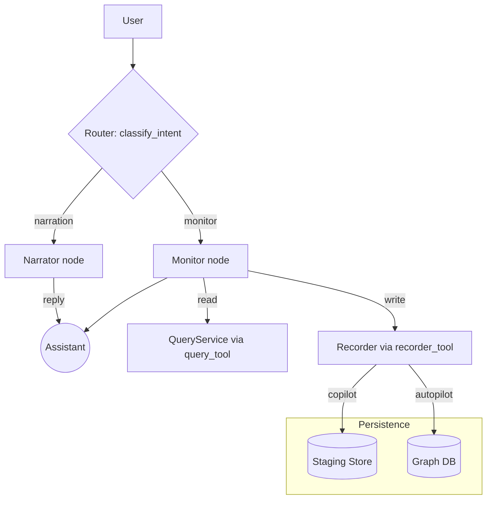
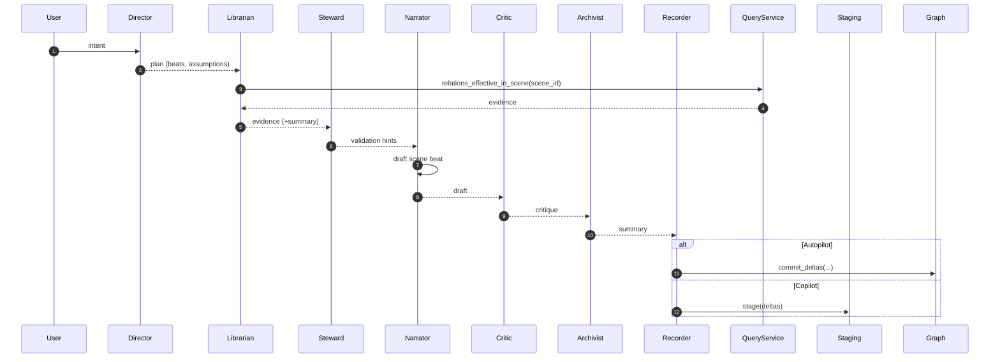
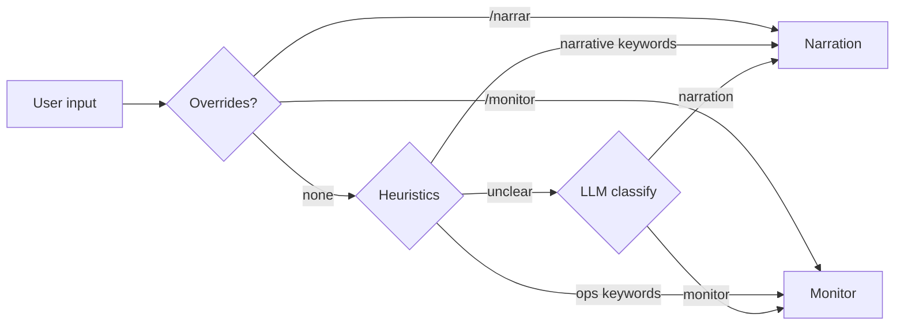

# Agents and Orchestration (LangGraph/LangChain)

This document explains how MONITOR’s agents work, how the LangGraph pipeline orchestrates them, and the expectations/policies for reads/writes, persistence, and roles.

## Goals and expectations

- Keep continuity: stories reference Entities, Scenes, Relations, and Facts with provenance.
- Be agent-first but safe: Narrator owns narrative drafting; Steward guards consistency; Recorder persists only when appropriate.
- Copilot by default: stage deltas; persist at safe boundaries (e.g., end of scene) or when autopilot is enabled.
- Clear separation of concerns:
  - Monitor: operational commands, routing, and wizards.
  - Narrator: narrative control; can propose ontology changes out of the story flow.
  - Archivist/Librarian: retrieval and summaries of canon.
  - Steward: validates coherence/policy before commits.

## Agent catalog (LLM-backed)

- Narrator (`core/agents/narrator.py`)
  - Role: Write short, scene-focused beats and ask one guiding question; maintain continuity.
  - Inputs: last turns, optional scene context; outputs: narrative draft.
  - Source of prompt: `config/agents.yaml` → key `narrator`.

- Archivist (`core/agents/archivist.py`)
  - Role: Summarize events succinctly; note threads and inconsistencies.
  - Inputs: draft or context; outputs: brief summary bullets.
  - Prompt key: `archivist`.

- Director (`core/agents/director.py`)
  - Role: Turn intent into a tiny actionable plan (2–4 beats, assumptions, next step).
  - Prompt key: `director`.

- Librarian (LLM) (`core/agents/librarian.py`)
  - Role: Summarize retrieved evidence (entities, scenes, relations) briefly.
  - Prompt key: `librarian`.

- Steward (LLM) (`core/agents/steward.py`)
  - Role: Validate coherence/policies, flag missing IDs, continuity risks, ontology write risks.
  - Prompt key: `steward`.

- Critic (`core/agents/critic.py`)
  - Role: Score clarity/pacing/hook; suggest 1–2 crisp improvements.
  - Prompt key: `critic`.

- Character (`core/agents/character.py`)
  - Role: Optional first-person NPC agent for in-character replies.

- Monitor (LLM) (`core/agents/monitor.py`)
  - Role: Classify user intent (narration vs operational); route accordingly; ask for missing IDs.
  - Prompt key: `monitor`.

Prompts are loaded from `config/agents.yaml` via `core/loaders/agent_prompts.py`.

## Orchestration backend

Default orchestration is the LangGraph pipeline (`core/engine/langgraph_flow.py`), a stateful DAG of nodes representing the workflow below. You can set `MONITOR_ENGINE_BACKEND=inmemory` to force a minimal fallback, but it’s primarily for tests.

Optional LangChain tools can be enabled with `MONITOR_LC_TOOLS=1`; see `core/engine/lc_tools.py`.

## Visuals (Mermaid)

### High-level routing and tools



Notes:
- Copilot (default) stages deltas; `end scene` flushes staging and auto-creates the next scene, then hands off to Narrator.
- Autopilot commits directly.
- Persistence policy: Pydantic-first. LangGraph nodes extract structured outputs into Pydantic models and write via Recorder. YAML is for prompts/config/fixtures only.

### LangGraph single-turn workflow



## LangGraph workflow (nodes)

Nodes and their responsibilities in `langgraph_flow.py`:

1) Director
- Input: `intent` (user goal)
- Output: `plan` (beats/assumptions) via `director_agent` when available; trivial fallback otherwise.

2) Librarian
- Retrieves evidence for the current `scene_id` using `query_tool` (relations, etc.).
- Optional: `librarian_agent` summarizes `evidence` into `evidence_summary`.

3) Steward
- Optional: `steward_agent` produces validation hints as lightweight warnings.
- Output: `validation` structure (ok + warnings).

4) Narrator
- Produces a narrative `draft` from the `intent` (+ optional evidence summary if you add it to the system message upstream).

5) Critic
- Optional: `critic_agent` scores or comments; otherwise a simple heuristic is returned.

6) Archivist
- Summarizes the draft into bullet points.

7) Recorder
- Writes via `recorder_tool` using `ToolContext`. In copilot, writes become staged deltas; in autopilot, they persist.
- Copilot gate: `MONITOR_COPILOT_PAUSE=1` pauses before Recorder.

State keys commonly passed along: `intent`, `scene_id`, `plan`, `evidence`, `validation`, `draft`, `critique`, `summary`, `commit`.

### Example state (single turn)

```json
{
  "intent": "The heroes sneak into the museum at night.",
  "scene_id": "scene:abcd1234",
  "plan": {"beats": ["sneak in", "avoid guards"], "assumptions": ["closed hours"]},
  "evidence": [{"relations": []}],
  "validation": {"ok": true, "warnings": []},
  "draft": "Moonlight glinted off the marble...",
  "critique": {"coherence": 0.9, "length": 132},
  "summary": "- Break-in at night; guards present; tension rising.",
  "commit": {"mode": "dry_run", "trace": ["recorder:dry_run"], "refs": {"scene_id": "scene:abcd1234"}}
}
```

## Router: narration vs monitor

`core/engine/langgraph_modes.py` implements a simple router:

- classify_intent: heuristic + optional LLM to pick `mode` ∈ {narration, monitor}.
- narrator_node: calls Narrator for diegetic replies.
- monitor_node: parses operational intents and executes read/write actions.

Monitor actions include: setup/start story wizard, lists/queries, write intents (add scene, modify scene, seed/create entities), transcripts, and scene boundary management.

Scene boundary policy:
- `end scene` flushes staged changes in copilot and auto-creates the next scene (sequence index increment), then nudges the router to narration so the Narrator decides the intro and cast.

### Router decision flow



## Tools and services

`ToolContext` (`core/engine/tools.py`): shared handles for read/write tools
- query_tool: whitelisted read calls to the QueryService (+ optional read-through cache).
- recorder_tool: applies deltas; in copilot, deltas are staged; in autopilot, persisted.
- Caching/staging: `core/engine/cache.py` (in-memory) or Redis variants.

Query/Recorder facades
- Query: `core/services/query_service.py` → `core/persistence/queries_lib/*` (graph reads).
- Recorder: `core/services/recorder_service.py` → `core/persistence/recorder.py` (graph writes).

## Read/write expectations and policies

- Narrator owns narrative drafting; can propose ontology changes implied by the story (new Entities/Scenes/Facts/Relations).
- Steward provides quick, conservative checks; deep validation lives in services/queries.
- Recorder commits:
  - Copilot (default): stage via `StagingStore`; persist at scene boundaries (`end scene`) or on explicit autopilot.
  - Autopilot: immediate commits.
- Monitor write intents exist for GM convenience (seeding PCs/NPCs, creating entities/scenes). You can restrict these if you want Narrator-led creation only.

## Configuration and prompts

- Agent prompts live in `config/agents.yaml` under each key (narrator, archivist, director, librarian, steward, critic, monitor).
- You can tune temperature/token budgets by adjusting the agent factory functions.

## Enabling LangChain tools (optional)

- Set `MONITOR_LC_TOOLS=1` to load LangChain Tools built from `ToolContext`.
- When enabled, Librarian may call LC tools internally for queries.

## Quick start (LangGraph)

1) Set backend:
   - `export MONITOR_ENGINE_BACKEND=langgraph`
2) Pick copilot/autopilot:
   - Copilot (default staging): `export MONITOR_COPILOT_PAUSE=0`
   - Autopilot: construct `ToolContext(dry_run=False)` (done by APIs depending on mode).
3) Provide an LLM backend via env (OpenAI-compatible or local) if desired.

## Extending agents

- Add a new agent module under `core/agents/` and a prompt in `config/agents.yaml`.
- Pass the new agent into the LangGraph flow via `run_once` (which assembles agents/tools) or by updating the tools package before calling `build_langgraph_flow`.
- Add a node in `langgraph_flow.py` and wire appropriate edges.

## References

- README overview: `README.md` (Objectives, Architecture, Ontology)
- Narrative Engine design: `docs/narrative_engine.md`
- Ontology model: `docs/ontology.md`
