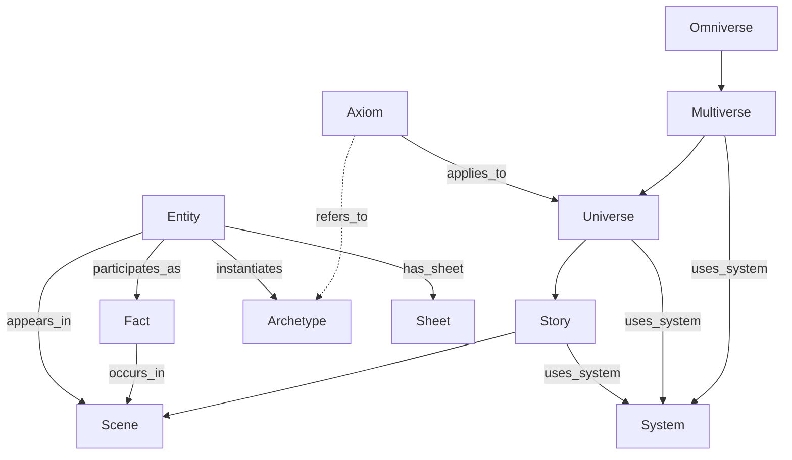
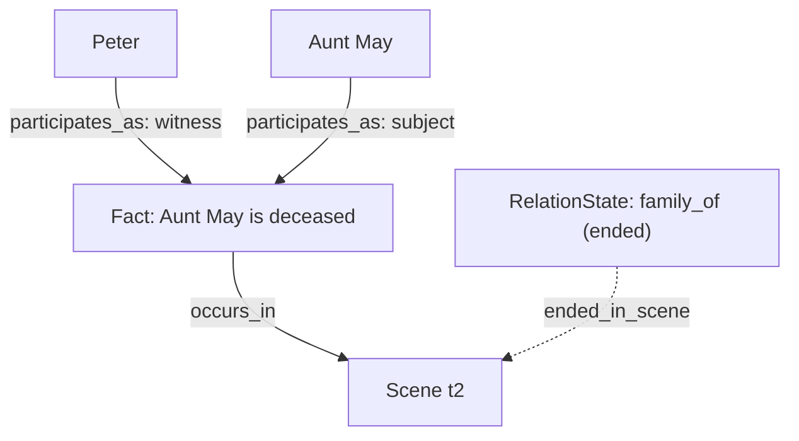

# M.O.N.I.T.O.R. — Multiversal Ontology (Updated with Facts)

**Purpose:** Definitive description of building blocks (Omniverse → Multiverse → Universe → Story → Scene; Axiom; Archetype; Entity; Fact), their relations, time semantics, and stewardship rules. This version explicitly elevates Facts as first-class records for events/assertions with provenance. Terminology harmonized with README and design addendum.

---

## 1) Building Blocks

### 1.1 Omniverse

The whole application platform (agents, narrative engine, data services, UI). **Abstract** container.

### 1.2 Multiverse

A family of universes sharing a canonical **axiom set** and (optionally) a default rule system. **Abstract** container.

### 1.3 Universe

A concrete worldline that inherits multiversal axioms and may **override/disable/add** local axioms. Holds **Entities, Relations, Stories, Scenes, Facts**.

### 1.4 Story

A narrative thread inside a Universe. Maintains a **timeline of scenes**, constraints (tone, rating), and a **story order within the Universe** for world timelines.

Fields: `id`, `title`, `ordering_mode: narrative|chronological|mixed`, `sequence_index` (universe-level order), `prev_id|next_id`, `time_span` (derived from scenes unless explicit), `scenes[]`.

Note: Each Story also references its Universe directly (e.g., `universe_id` field or edge), even when grouped by Arc. This enables efficient queries and clear ownership.

### 1.4a Arc (group of stories)

A thematic, causal, or entity-based grouping of Stories within a Universe. Enables navigation, querying, and stewardship of related stories (e.g., "Spider-Verse", "New York Stories").

Fields: `id`, `title`, `universe_id`, `story_ids[]`, `tags[]`, `entity_ids[]?`, `time_span?`, `ordering_mode?`.

### 1.5 Scene

Atomic narrative unit inside a Story. Carries **world time** (`when|time_span`) and optional **session time** (`recorded_at`).

Fields: `id`, `when|time_span`, `recorded_at?`, `location?`, `participants[]`, `sequence_index` (story order), `prev_id|next_id` (optional chain).

### 1.6 Axiom (world constraints/properties)

Declarative rule/tendency.

* Types: `universal | probabilistic | conditional`
* Semantics (examples): `existence`, `min_count`, `constraint`, `implication`
* Scope: applies at multiverse by default, **APPLIES\_TO** universes; can be overridden/disabled locally.

### 1.7 Archetype (entity-class template)

Blueprint for entities. Constrains `allowed_kinds`, `must_have_tags`, typical `traits`. Often **referred to by axioms**; Entities may **INSTANTIATES → Archetype** (optional).

### 1.8 Entity (concrete, in-universe)

Materialized narrative object.

* Kind: `character|place|object|organization|concept`
* Traits/State/Tags
* Memory links (docs, embeddings, assets)
* Scope: **belongs to Universe**, appears in Stories/Scenes; may instantiate an Archetype.

### 1.9 Fact (**first-class event/assertion with provenance**)

Time-stamped, n‑ary, auditable record with participants and sources.

* Kinds: **Event**, **State assertion**, **Derived/inferred**
* Core fields: `id`, `universe_id`, `description`, `time_span|when`, `participants[] {entity_id, role}`, `source_refs[]`, `confidence`, `derived_from[]?`.
* Edges: `Entity -[:PARTICIPATES_AS(role)]-> Fact`, `Fact -[:OCCURS_IN]-> Scene`, optional `Fact -[:SUPPORTS|:CONTRADICTS]-> Fact`.

### 1.9a System (rule system)

Serializable rule set that governs dice, stats, resources, conditions, actions, roll mechanics, and resolution rules. Systems are defined in YAML/JSON (see `universal_dice_system.md`) and can be inherited/overridden along Multiverse → Universe → Story.

Fields (summary): `id`, `name`, `version`, `dice_pool[]`, `stats[]`, `resources[]`, `conditions[]`, `actions[]`, `roll_mechanic`, `resolution_rules[]`, `progression`, `character_creation`, `critical_rules`, `metadata`.

### 1.9b Sheet (character sheet)

An instance of a System-bound schema for a concrete Entity (usually a character, but also places/objects). Holds stats/resources/tags per the active System and can vary per Story.

Fields (summary): `id`, `entity_id`, `system_id`, `story_id?`, `attributes` (stats/resources/conditions/tags/etc per system), `metadata`.
* Relation to axioms: Facts can **document** fulfillment/violation of axioms (e.g., first instantiation of an archetype), but **are not axioms**.
* Relation to relations: Facts often **cause** `RelationState` changes; link through the Scene that set/changed/ended them.

### 1.10 Choosing the right building block

| Model need                                   | Use           | Rationale                                        |
| -------------------------------------------- | ------------- | ------------------------------------------------ |
| Rule/tendency governing universes            | **Axiom**     | Declarative, inherited/overridden; drives checks |
| Reusable template/class of entities          | **Archetype** | Constrains kind/tags/traits                      |
| Concrete thing in a universe                 | **Entity**    | Holds state/traits; can instantiate archetype    |
| Something that happened / asserted at a time | **Fact**      | Time-stamped, n‑ary, scene-linked evidence       |
| Rules for play                               | **System**    | Defines dice, stats, actions, resolution rules   |
| Gameplay state per entity                    | **Sheet**     | System-conforming sheet for an Entity            |

---

## 2) Identity, Context, and Scoping

* IDs: `omniverse_id`, `multiverse_id`, `universe_id`, plus local ids for stories/scenes/entities/facts.
* **ContextToken** selects universe+time and isolates reads/writes.

```yaml
ContextToken:
  omniverse_id: string
  multiverse_id: string
  universe_id: string
  time_ref: string | null
  mode: "copilot" | "autopilot" | "assistant"
```

---

## 3) Graph Semantics & Time

### 3.1 Core edges

* `BELONGS_TO`: `Entity → Universe`
* `HAS_ARC`: `Universe → Arc` (**groups arcs in a universe**)
* `HAS_STORY`: `Arc → Story` (**groups stories in an arc; carries `sequence_index` for arc order**)
* `HAS_STORY`: `Universe → Story` (**carries `sequence_index` for world timeline order; also used for direct story lookup and ownership**)
* `NEXT_STORY`: `Story → Story` (optional chain; DAG)
* `HAS_SCENE`: `Story → Scene` (**carries `sequence_index` for story order**)
* `NEXT_SCENE`: `Scene → Scene` (optional chain; DAG)
* `APPEARS_IN`: `Entity → Scene`
* `OCCURS_IN`: `Fact → Scene`
* `PARTICIPATES_AS(role)`: `Entity → Fact`
* `REL(type, weight, temporal?)`: simple inter-entity relation (timeless or interval)
* `REL_STATE_FOR`: `RelationState → (Entity A, Entity B)` (versioned relation snapshot)
* `SET_IN_SCENE|CHANGED_IN_SCENE|ENDED_IN_SCENE`: `RelationState ↔ Scene` (provenance)
* `INSTANTIATES`: `Entity → Archetype`
* `APPLIES_TO`: `Axiom → Universe`
* `REFERS_TO`: `Axiom → (Archetype|Entity|RelationType|FactPattern)`
* `DERIVES_FROM`: `Universe → Universe` (what‑if branch)
* `USES_SYSTEM`: `(Multiverse|Universe|Story) → System` (policy: nearest scope wins)
* `HAS_SHEET`: `Entity → Sheet` (optionally scoped by Story via `story_id`)

### 3.2 Time axes

* **World time**: `when|time_span` on Scenes/Facts/Relations.
* **Session time**: `recorded_at` on Scenes (real time when played/logged).

### 3.3 Relation lifecycle modes

* **Timeless**: `REL(type)` (no start/end)
* **Interval**: `REL(type, temporal={started_at, ended_at})`
* **Versioned**: `RelationState` nodes + per‑scene provenance (`SET_IN_SCENE`, …)

---

### 3.4 Relationship catalogue & usage

Below are the **first‑class relations** (edges) we use in the graph, with domain/range, cardinality, key properties, and intended usage.

| Edge                             | Domain → Range                                      | Cardinality    | Key props                        | Usage & Notes                                                                             |
| -------------------------------- | --------------------------------------------------- | -------------- | -------------------------------- | ----------------------------------------------------------------------------------------- |
| **BELONGS\_TO**                  | Entity → Universe                                   | many→1         | —                                | Scopes an entity to its universe. No cross‑universe leakage.                              |
| **HAS\_STORY**                   | Universe → Story                                    | 1→many         | `sequence_index`                 | Orders stories in the **world timeline** of the universe; also used for direct story lookup and ownership. |
| **NEXT\_STORY**                  | Story → Story                                       | 0..1 per Story | —                                | Optional chain for linear browsing; must form a DAG.                                      |
| **HAS\_SCENE**                   | Story → Scene                                       | 1→many         | `sequence_index`                 | Orders scenes **inside the story** (narrative order).                                     |
| **NEXT\_SCENE**                  | Scene → Scene                                       | 0..1 per Scene | —                                | Optional chain; must form a DAG.                                                          |
| **APPEARS\_IN**                  | Entity → Scene                                      | many→many      | —                                | Participation of entities in scenes (exposure in time).                                   |
| **OCCURS\_IN**                   | Fact → Scene                                        | many→1         | —                                | Provenance of events/assertions.                                                          |
| **PARTICIPATES\_AS**             | Entity → Fact                                       | many→many      | `role`                           | N‑ary actor roles in Facts (attacker/defender/witness/subject…).                          |
| **REL**                          | Entity → Entity                                     | many→many      | `type`, `weight`, `temporal?`    | Simple relation (timeless/interval). Prefer **REL\_STATE\_FOR** for versioned lifecycles. |
| **REL\_STATE\_FOR**              | RelationState → (Entity A, Entity B)                | many→2         | `type`, `started_at`, `ended_at` | Versioned relation snapshots. Changes reference scenes via `SET/CHANGED/ENDED_IN_SCENE`.  |
| **SET/CHANGED/ENDED\_IN\_SCENE** | RelationState ↔ Scene                               | many→1         | —                                | Provenance of relation changes (who/when in narrative).                                   |
| **INSTANTIATES**                 | Entity → Archetype                                  | 0/1 per Entity | —                                | Optional binding of an entity to an archetype template.                                   |
| **APPLIES\_TO**                  | Axiom → Universe                                    | many→many      | —                                | Axioms inherited from multiverse or local to universe.                                    |
| **REFERS\_TO**                   | Axiom → (Archetype/Entity/RelationType/FactPattern) | many→many      | —                                | Targets of axioms (existence, min\_count, constraints, implications).                     |
| **DERIVES\_FROM**                | Universe → Universe                                 | 1→1            | `branch_origin_scene?`           | What‑if branch lineage (copy‑on‑write semantics in app layer).                            |
| **USES_SYSTEM**                  | (Multiverse/Universe/Story) → System                | 0..1 per scope | `effective_from?`                | Rule system binding; Story overrides Universe, Universe overrides Multiverse.             |
| **HAS_SHEET**                    | Entity → Sheet                                      | many→many      | `story_id?`, `system_id`         | Attach sheets to entities; different stories may use different systems.                   |
| **HAS_ARC**                      | Universe → Arc                                      | 1→many         | —                                | Groups arcs in a universe.                                                                |
| **HAS_STORY**                    | Arc → Story                                         | 1→many         | `sequence_index`                 | Orders stories in the arc.                                                                |

## 6) Authoring (YAML snippets)

Pydantic-first is the canonical model. The following YAML snippets are illustrative fixtures/config forms; at runtime the API accepts/returns JSON (Pydantic DTOs). YAML is optional for seeds and human-readable exports.

### 6.3a Arcs

```yaml
# universes/earth_616/arcs.yaml
- id: arc-spider-verse
  title: "Spider-Verse"
  universe_id: earth_616
  story_ids: [spider-saga, venom-saga]
  tags: ["multiversal", "crossover"]
  entity_ids: [ent-peter-616, ent-miles-1610]
  time_span: { started_at: "2002-01-01", ended_at: "2010-12-31" }
```

**Steward invariants:** `NEXT_*` must form DAGs; `sequence_index` contiguous; interval relations cannot overlap for same `(A,B,type)`; versioned chains must be coherent.

## 4) Ontology Model (How it binds together)

1. **Axioms** apply to universes; can refer to **Archetypes** for existence/min\_count.
2. **Archetypes** constrain potential entities; entities may **instantiate** them.
3. **Facts** record concrete occurrences/assertions, with **Scene** provenance and participants, often causing **relation/entity state** transitions.
4. **Stories/Scenes** provide both **narrative order** and **chronological order**.
5. **Relations** can be timeless/interval or fully versioned with per‑scene change logs.
6. **Branches** (`DERIVES_FROM`) fork from a scene snapshot; diffs highlight new Facts, relation changes, and state edits.

---

## 5) Mermaid (overview)

### 5.1 Building blocks



### 5.2 Events & relation provenance



---

## 6) Authoring (YAML snippets)

### 6.1 Axioms & archetypes

```yaml
# multiverse/axioms.yaml
- id: AX-SPIDER-EXISTENCE
  type: probabilistic
  semantics: existence
  description: "At least one Spider Totem Bearer exists."
  probability: 0.85
  refers_to_archetype: ARC-SPIDER-TOTEM

# multiverse/archetypes.yaml
- id: ARC-SPIDER-TOTEM
  name: "Spider Totem Bearer"
  constraints:
    allowed_kinds: ["character"]
    must_have_tags: ["spider"]
    typical_traits:
      agility: "high"
      spider_sense: true
```

### 6.2 Entities

```yaml
# universes/earth_616/entities.yaml
- id: ent-peter-616
  kind: character
  name: "Peter Parker"
  archetype_id: ARC-SPIDER-TOTEM   # optional
  tags: ["spider", "hero"]
  traits: { occupation: "photographer" }
  state: { public_identity: false }
```

### 6.3 Stories & scenes (ordering)

```yaml
# universes/earth_616/stories/spider-saga.yaml
id: spider-saga
ordering_mode: narrative
sequence_index: 2   # universe-level order
scenes:
  - id: sc-001
    sequence_index: 1
    when: "2007-05-02"
  - id: sc-002
    sequence_index: 2
    time_span: { started_at: "2002-01-01", ended_at: "2002-01-01" } # flashback
next_links:
  - { from: sc-001, to: sc-002 }
```

### 6.4 Facts

```yaml
# universes/earth_616/facts.yaml
- id: fact-aunt-may-status
  description: "Aunt May is deceased"
  when: "2008-06-30T09:00:00Z"
  occurs_in_scene: sc-028
  participants:
    - { entity_id: ent-aunt-may, role: "subject" }
  source_refs: ["doc://news/obituary#clipping"]
  confidence: 0.8
```

### 6.5 Relations (three modes)

```yaml
# timeless
- from: ent-peter-616
  to: ent-mj-616
  type: loves
  mode: timeless
  weight: 5

# interval
- from: ent-peter-616
  to: ent-mj-616
  type: loves
  mode: interval
  temporal: { started_at: "2002-01-01", ended_at: "2008-06-30" }

# versioned
- id: rel-peter-mj-loves
  between: { a: ent-peter-616, b: ent-mj-616 }
  type: loves
  mode: versioned
  states:
    - started_at: "2002-01-01"
      set_in_scene: sc-002
    - changed_at: "2006-03-10"
      weight: 3
      changed_in_scene: sc-015
    - ended_at: "2008-06-30"
      ended_in_scene: sc-028
```

---

## 7) Stewardship (validation rules)

* **Coverage:** axioms with `semantics: existence|min_count` + `REFERS_TO Archetype` → count `INSTANTIATES` in universe; warn if unmet (severity may derive from probability).
* **Constraints:** if `Entity → Archetype`, enforce `allowed_kinds` & `must_have_tags`; warn on mismatch.
* **Fact-backed changes (policy):** critical state/relationship transitions should have a **Fact** with `OCCURS_IN Scene`; otherwise flag low provenance.
* **Temporal consistency:** forbid overlapping mutually exclusive states; validate relation intervals and version chains.
* **Ordering integrity:** contiguous `sequence_index` for scenes (1..N) and stories (1..N); `NEXT_SCENE`/`NEXT_STORY` are DAGs; chronological policies enforced when configured.
* **Branch diffs:** for `DERIVES_FROM`, compute typed diff (new Facts, relation edits, state changes) before promotion to canon.

---

## 8) Query primer (pseudo‑Cypher & patterns)

This section shows **concrete queries/patterns** aligned with your earlier examples. Replace `$…` with parameters.

### 8.1 What‑if branch from a Scene (fork and apply deltas)

**Goal:** branch universe `U'` at `scene scK` of `U`, then apply changes (e.g., Aunt May dies) without contaminating canon.

```cypher
// (A) Mark branch lineage (writes usually done in app layer)
MATCH (u:Universe {id:$U}), (sc:Scene {id:$scK, universe_id:$U})
CREATE (u2:Universe {id:$U2, branch_origin_scene:$scK})-[:DERIVES_FROM]->(u);
```

Apply deltas in `U2` (app/API): add a **Fact** (death), update **Entity.state**, and/or end relevant **RelationState** referencing the scene that caused it. Then:

```cypher
// (B) Typed diff since branch origin (U2 vs U)
MATCH (u2:Universe {id:$U2})-[:DERIVES_FROM]->(u:Universe)
// Example: facts present in U2 but not in U
OPTIONAL MATCH (f2:Fact)-[:BELONGS_TO]->(u2)
OPTIONAL MATCH (f1:Fact {id:f2.id})-[:BELONGS_TO]->(u)
WHERE f1 IS NULL
RETURN collect(f2.id) AS new_facts;
```

### 8.2 Story BEFORE/DURING/AFTER in **world time**

```cypher
MATCH (a:Story {id:$A}), (b:Story {id:$B})
RETURN a.time_span AS A, b.time_span AS B;
// Compare in app:
// BEFORE: A.end < B.start
// AFTER:  A.start > B.end
// DURING: A.start >= B.start AND A.end <= B.end
// OVERLAPS otherwise
```

### 8.3 Story order in **true time** (session time)

```cypher
MATCH (st:Story {id:$S})-[:HAS_SCENE]->(sc:Scene)
RETURN st.id AS story, min(sc.recorded_at) AS session_start, max(sc.recorded_at) AS session_end
ORDER BY session_start ASC;
```

### 8.4 Is there a character I can use based on an archetype in this universe?

```cypher
// Existing instantiations
MATCH (u:Universe {id:$U}),(arc:Archetype {id:$ARC})
OPTIONAL MATCH (e:Entity)-[:BELONGS_TO]->(u),(e)-[:INSTANTIATES]->(arc)
RETURN collect(e.id) AS instances;
```

Suggest free‑form candidates that **fit constraints** (kind/tags):

```cypher
MATCH (u:Universe {id:$U}),(arc:Archetype {id:$ARC})
MATCH (e:Entity)-[:BELONGS_TO]->(u)
WHERE (arc.constraints.allowed_kinds IS NULL OR e.kind IN arc.constraints.allowed_kinds)
  AND (arc.constraints.must_have_tags IS NULL OR ALL(t IN arc.constraints.must_have_tags WHERE t IN e.tags))
  AND NOT (e)-[:INSTANTIATES]->(arc)
RETURN e.id AS candidate;
```

If an **existence/min\_count** axiom refers to `$ARC` and applies to `$U`, the Steward will surface a **coverage warning** if `instances` is empty.

### 8.5 Create a character from an archetype vs free‑form (API‑first)

Prefer API for writes; Cypher below is illustrative.

```cypher
// (A) From archetype
MATCH (u:Universe {id:$U}),(arc:Archetype {id:$ARC})
CREATE (e:Entity {id:$EID, kind:$KIND, name:$NAME, traits:$TRAITS, tags:$TAGS})-[:BELONGS_TO]->(u)
CREATE (e)-[:INSTANTIATES]->(arc);

// (B) Free‑form entity (no archetype)
MATCH (u:Universe {id:$U})
CREATE (e:Entity {id:$EID, kind:$KIND, name:$NAME, traits:$TRAITS, tags:$TAGS})-[:BELONGS_TO]->(u);
```

### 8.6 What changed in Scene `sc` (relations + facts)

```cypher
MATCH (sc:Scene {id:$sc})
OPTIONAL MATCH (rs:RelationState)-[r:SET_IN_SCENE|CHANGED_IN_SCENE|ENDED_IN_SCENE]->(sc)
OPTIONAL MATCH (f:Fact)-[:OCCURS_IN]->(sc)
RETURN type(r) AS rel_change, rs.type AS rel_type, rs.started_at, rs.ended_at, collect(f.id) AS facts;
```

### 8.7 Active relation between A and B at time `t`

```cypher
MATCH (a:Entity {id:$A}),(b:Entity {id:$B})
MATCH (rs:RelationState {type:$TYPE})-[:REL_STATE_FOR]->(a)
MATCH (rs)-[:REL_STATE_FOR]->(b)
WHERE rs.started_at <= $t AND (rs.ended_at IS NULL OR $t < rs.ended_at)
RETURN rs LIMIT 1;
```

> **Note:** For world vs session time, always specify which axis you query (`time_span` vs `recorded_at`). For ordering, rely on `sequence_index` but validate chronology when policy is `chronological`.

## 9) Steward Invariants — Operational Checklist

Use this table as a hard gate in CI and as runtime assertions in the **Steward**.

| Area                        | Invariant                                                                               | How to Validate                                                  |                                   |
| --------------------------- | --------------------------------------------------------------------------------------- | ---------------------------------------------------------------- | --------------------------------- |
| **Scene order**             | `sequence_index` per Story is contiguous (1..N), no duplicates                          | COUNT vs MAX, unique constraint; optional `NEXT_SCENE` DAG check |                                   |
| **Story order**             | `sequence_index` per Universe is contiguous (1..N), no duplicates                       | COUNT vs MAX; optional `NEXT_STORY` DAG check                    |                                   |
| **DAGs**                    | `NEXT_SCENE` and `NEXT_STORY` contain **no cycles**                                     | cycle detection over subgraph                                    |                                   |
| **Chronology policy**       | If Story/Universe policy = `chronological`, start times are **non‑decreasing** by order | compare adjacent items by `time_span.start`                      |                                   |
| **World vs Session time**   | Scenes may have both; queries must specify axis explicitly                              | API requires \`axis=world                                        | session\`                         |
| **Interval relations**      | For same `(A,B,type)`, intervals **do not overlap**                                     | sweep‑line or SQL/graph interval overlap query                   |                                   |
| **Versioned relations**     | Version chain has coherent `started_at/ended_at`; each change references a Scene        | check `SET/CHANGED/ENDED_IN_SCENE` presence and ordering         |                                   |
| **Fact‑backed transitions** | Critical state/relation changes have an associated **Fact** (policy)                    | enforce on write; audit periodically                             |                                   |
| **Archetype coverage**      | For axioms with \`existence                                                             | min\_count\`, Universe meets required instantiations             | count `INSTANTIATES` vs threshold |
| **Axiom overrides**         | Overrides/disable are explicit and auditable                                            | diff multiverse vs universe axiom sets                           |                                   |
| **Branch diffs**            | `DERIVES_FROM` child has typed diff (Facts/Relations/States) before promotion           | graph diff job + human review                                    |                                   |
| **Provenance**              | Facts and RelationState changes point to the Scene that caused them                     | presence of `OCCURS_IN` and `*_IN_SCENE` edges                   |                                   |

---

## 10) Minimal API Endpoints (aligned with queries)

> **Note:** IDs and `ContextToken` are required in headers or query for scoping. Responses are JSON; examples are abbreviated.

### 10.1 Universe branching & diffs

* `POST /universes/{u}/branch`
  **Body:** `{ "origin_scene": "scK", "new_universe_id": "u2" }`
  **Resp:** `{ "universe_id": "u2", "derives_from": "u", "branch_origin_scene": "scK" }`

* `GET /universes/{u2}/diff`
  **Query:** `base=u`
  **Resp:** `{ "facts_added": [...], "relations_changed": [...], "entities_changed": [...] }`

### 10.2 Stories & scenes ordering

* `GET /universes/{u}/stories`
  **Query:** `order=world|session`
  **Resp:** ordered stories with `sequence_index`, `time_span`, `session_span`.

* `GET /stories/{s}/scenes`
  **Query:** `order=narrative|chronological`
  **Resp:** ordered scenes with `sequence_index`, `when|time_span`.

### 10.3 Facts & relation provenance

* `GET /scenes/{sc}/changes`
  **Resp:** `{ "facts": [...], "relation_changes": [{"type": "SET|CHANGED|ENDED", "relation_type": "loves", ...}] }`

* `POST /facts`
  **Body:** `{ id, universe_id, description, when|time_span, occurs_in_scene, participants[], source_refs[], confidence }`

### 10.4 Archetypes & entities

* `GET /universes/{u}/archetypes/{arc}/coverage`
  **Resp:** `{ "instances": [...], "count": 1, "min_required": 1, "meets": true }`

* `POST /universes/{u}/entities`
  **Body:** `{ id, kind, name, traits?, tags?, archetype_id? }`
  **Resp:** entity JSON; if `archetype_id` present, run constraint checks.

* `GET /universes/{u}/archetypes/{arc}/candidates`
  **Resp:** free‑form entities that satisfy archetype constraints but are not yet bound.

### 10.5 Relations

* `GET /relations/active`
  **Query:** `a=..., b=..., type=..., t=...` (world time)
  **Resp:** relation state if active at `t`.

* `POST /relations`
  **Body:** timeless/interval or versioned spec; for versioned, each state must reference a Scene.

---

## 11) Rationale

* Facts make **provenance explicit**, enable **n‑ary roles**, and support **what‑if branching** and **auditable diffs**.
* Separating **Axioms/Archetypes/Entities/Facts** matches TBox/ABox best practices and keeps validations simple and scalable.
* The API surfaces the same primitives as the ontology, making it easy to test with synthetic data and evolve policies without schema churn.
